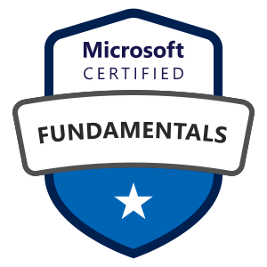
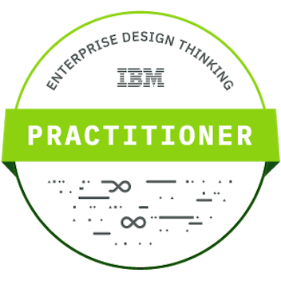

# Senior Ruby Developer / Cloud Technology Specialist
## __Emil Oszmánbegovity__
- website: [emilosman.com](https://emilosman.com)
- email: [hello@emilosman.com](mailto:hello@emilosman.com)
- github: [emilosman](https://github.com/emilosman)
- linkedin: [in/emilosman](https://www.linkedin.com/in/emilosman/)

## Summary
Focused creative problem solver, working in software development since 2016.  
Specialized in Ruby development and cloud technologies.  
Skilled communicator with in-depth technical knowledge.

## Tech skills
- Ruby, Rails
- JavaScript, TypeScript, React, Next.js
- PostgreSQL, MongoDB
- Sidekiq, Elasticsearch, Redis
- Object-Oriented Programming
- Object-Oriented Design
- SOLID Principles
- Refactoring
- Test Driven Development
- Git, Version Control
- HTML5, CSS3, SCSS
- Agile Development Practices
- Software Architecture Patterns and Pattern Languages
- Microservices Architecture
- Virtualization, Hyper-V
- Containerization, Docker, k8s
- CI/CD, GitHub Actions
- Linux and Unix systems
- Bash scripting

## Soft Skills
- Excellent written and spoken English
- Willingness to share knowledge and mentor juniors
- Comfortable communicating with clients
- Managerial experience
- Diligent note-taker and archivist
- Passion for learning and continuous improvement
- Systems thinking
- Performing highly open-ended and conscientious work
- Hungarian and Serbian native speaker

## __Experience__

## Senior Ruby Developer - Freelance
`December 2022 to present`

Clients include:

- [Beeple](https://www.beeple.eu/) `(Antwerp, Belgium)`
  Rails backend developer at startup helping companies schedule temp workers.
- [CoverWallet](https://www.coverwallet.com/) `(Madrid, Spain)`
  Software engineer in the insurance industry with exposure to complex cloud systems.
  Wrote integrations for APIs of multiple insurance companies.  
  Tech used: Google Cloud Platform, k8s, Microservices, Ruby

## Technical Architect - [MentorMate](https://mentormate.com/)
`March 2022 to November 2022 - Sofia, Bulgaria`

Projects:
- Mapping of existing on-premise architecture and working closely with DevOps specialists and Technical Architects to create hybrid deployments on Azure.
- Conducted deep interviews with key technical personnel to assess software stacks, maintenance, security and encryption, finances and spending, and regulatory compliance.
- Consulted on greenfield projects taking into account client's functional and non-functional requirements.

Responsibilities:
- Creating technical and solution architectures
- Facilitating client communication and meetings
- Generating architecture diagrams
- Composing documentation and delivering presentations
- Communicating effectively with both technical and non-technical stakeholders
- Collaborating with Designers, Business Analysts, and Project Managers across various departments

## Senior Ruby Developer - [MentorMate](https://mentormate.com/)
`November 2020 to November 2022 - Sofia, Bulgaria`

Backend Ruby on Rails developer handling both core application features and custom client enhancements and integrations.  
Taking on leadership roles and mentoring junior developers and bootcampers.

## Full-stack Web Developer - [Sideqik](https://www.sideqik.com/)
`November 2018 to March 2020 - Atlanta, USA`

Worked full-stack in a startup environment, developing an influencer marketing platform.

Responsibilities:
- Frontend Overhaul - Contributed to migration of frontend from Rails server-side rendering / Spine.js to Ember, then used Ember to build and document a component library and accelerate future development.
- Major Features - Contributed to the frontend and backend development of: 1-on-1 and bulk messaging with merge tags, let customers do much more of their marketing process without leaving the app • Ember, Rails, Gmail API, Twitter DM API, SMTP

## Web Developer - [aac.digital](http://aac.digital/)
`July 2017 to October 2018 - Budapest, Hungary`

Full-time Rails developer. Worked on projects for clients like METRO, Telenor, Jamie Oliver, BRF S.A., Zsidai Group. Learned the Ember.js frontend framework.

## Freelance Web Developer
`November 2016 to July 2017`

Started professional career building Ruby on Rails applications. Worked with the Hungarian company [aac.digital](https://aac.digital/) as a freelancer. Roles on projects included frontend and backend development.

## Open-Source Code
`November 2016 to present`

I publish my open-source work on GitHub: [emilosman](https://www.github.com/emilosman)

## [Personal Projects and Experiments](/pages/personal-projects)
Various projects meant to make life easier with automation and data analysis.  
Some open-source, some closed-source, most for fun.  
[View the list here.](/pages/personal-projects)

## Education and Certification
I continually strive to advance my knowledge with industry standard resources.

- [Microsoft Certified: Azure Fundamentals](https://learn.microsoft.com/en-us/users/emilosman/credentials/5b393ffcfcac8312)
- [IBM: Enterprise Design Thinking Practitioner](https://www.credly.com/badges/351edaee-062d-45e6-b948-f798e7c598f4)
- [My Microsoft Learn profile](https://learn.microsoft.com/en-us/users/emilosman/)
- Actively pursuing: _AWS Certified Developer - Associate - DVA-C02_

