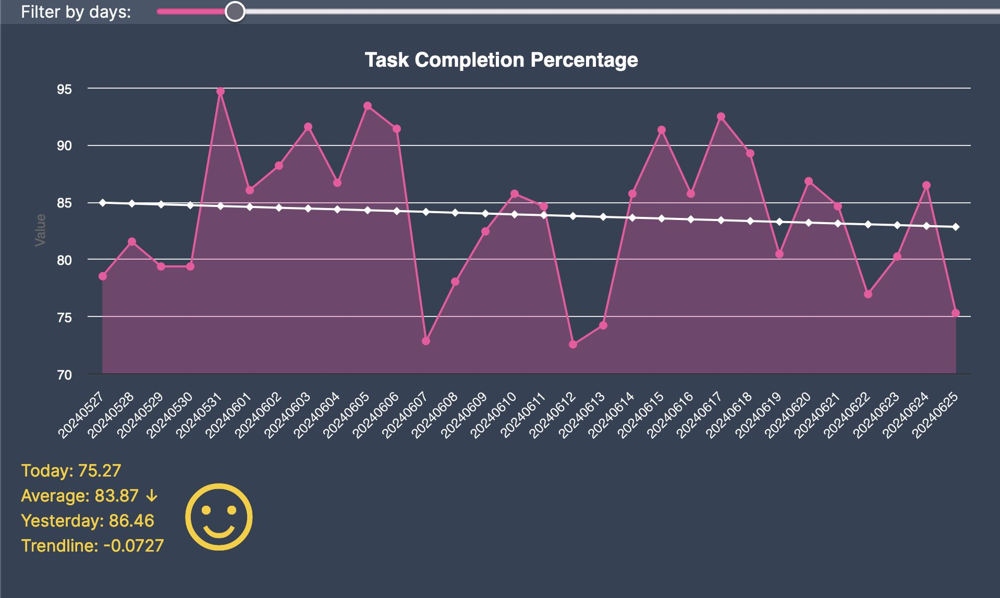
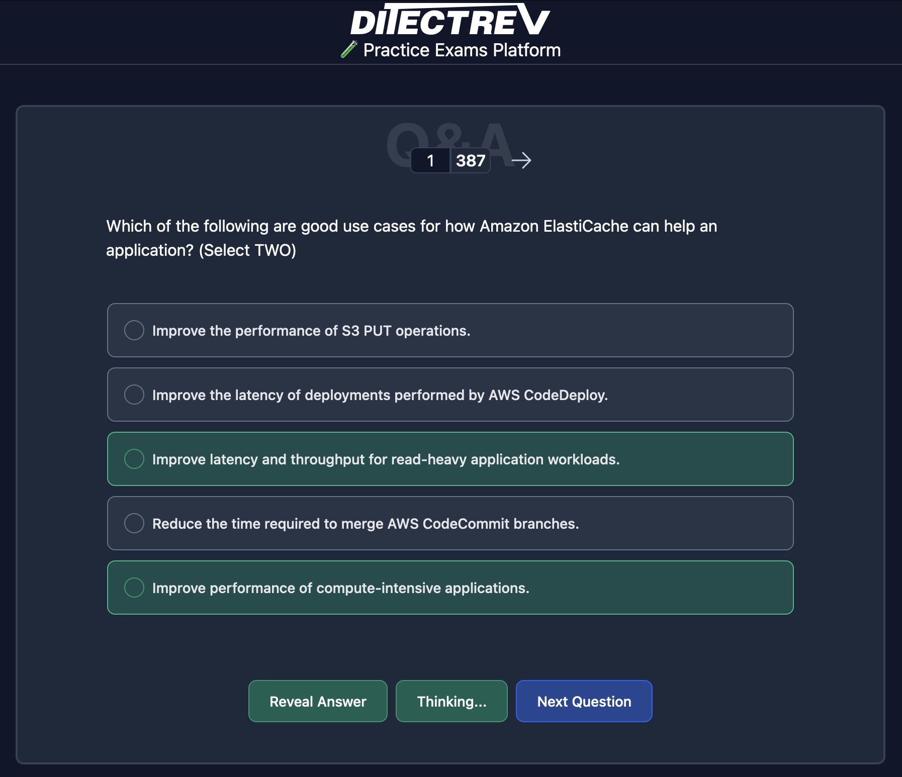
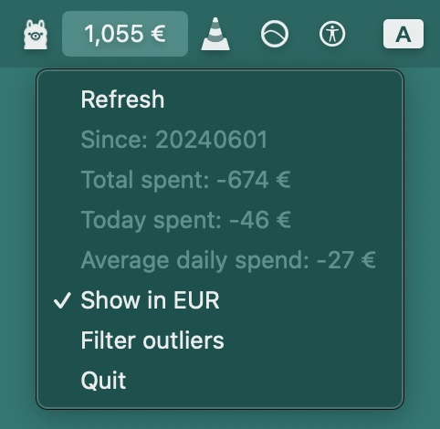
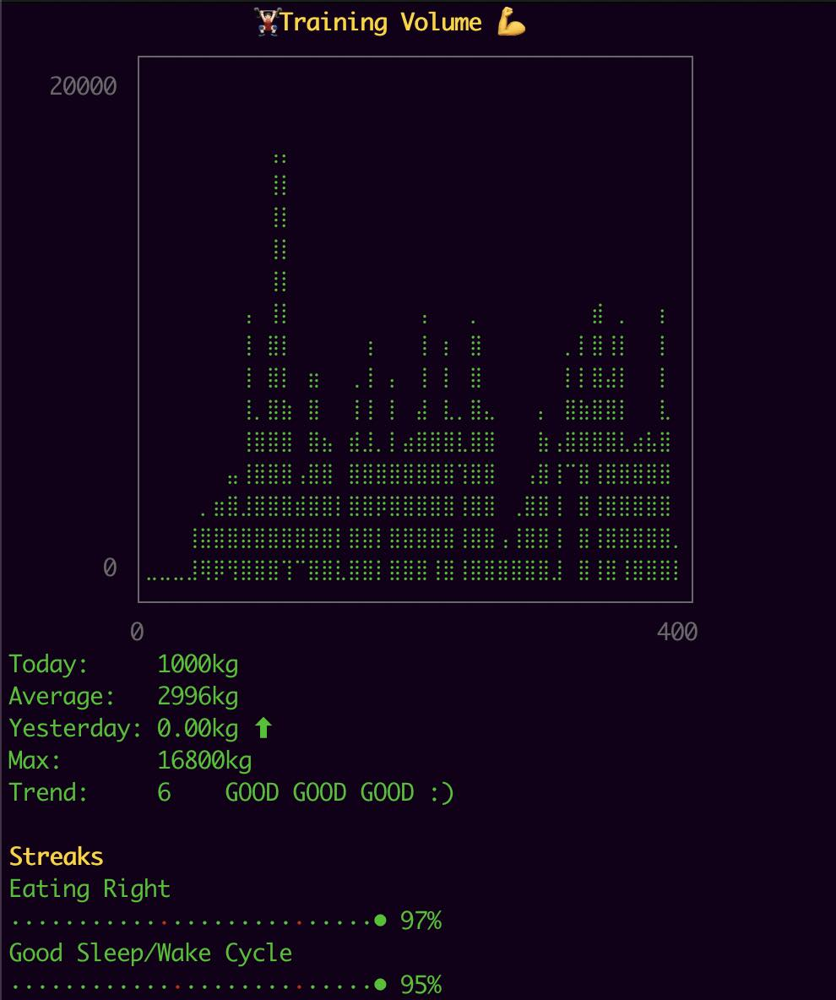

# Personal Projects and Experiments
Various projects meant to make life easier with automation and data analysis.  
Some open-source, some closed-source, most for fun.

## [exo-cli](https://github.com/emilosman/exo-cli)
- CLI helper for my _exocortex_
- [built with rwxrob's bonzai template](https://github.com/rwxrob/bonzai)
- Tech used: `Go`

## [homelab](https://github.com/emilosman/homelab)
- Test bed for practicing virtualization and containerization on my home server
- Tech used: `Ansible, Terraform, Bash, Podman, QEMU, libvirt`

## exo-js

- Graphical frontend for for my `plot.rb` productivity tracker.
- Graphing and data visualization.
- Tech used: `TypeScript, React, NextJS, ChartJS, Ruby, Sinatra`

## [Ditectrev Education Platform contributions](https://education.ditectrev.com/)

- Contributed an AI feature that provides explanations for exam questions and answers on the open-source [Ditectrev Education Platform](https://education.ditectrev.com/).
- [Press release](https://www.linkedin.com/posts/ditectrev_ollama-ollama-opensource-activity-7203245362797506560-c9Jk)
- Tech used: `TypeScript, React, NextJS, Ollama, AI/LLM prompting`

## fintra.py

- Personal finance tracking app that parses bank CSV exports and provides insight into spending.
- MacOS menu bar integration
- Outlier detection
- Currency conversion
- Tech used: `Python, pandas`

## plot.rb

- _Exocortex_ that houses a personal archive of notes
- CLI interface with graphing ability
- Tracks habits, mood, work time, exercise volume, etc.
- Daily diary automation
- AI/LLM interface for analyzing the data store
- Tech used: `Ruby, Ollama, AI/LLM prompting`

## kicomp.xyz

- Personal home server running on a spare parts Linux machine
- Git server
- RAID storage
- Automated daily backups
- Automated reporting
- Dedicated Telegram bot
- DDNS
- Tech used: `Linux, Bash, Python`

