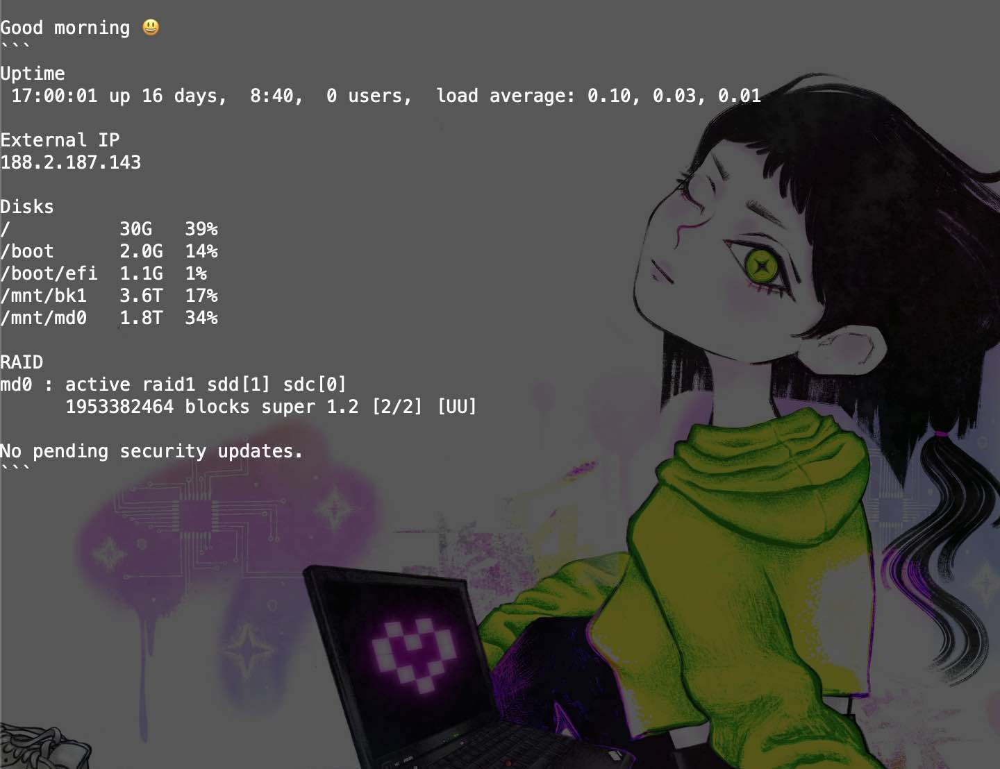

# Personal Projects and Experiments
Various projects meant to make life easier with automation and data analysis.  
Some open-source, some closed-source, most for fun.

## daily
- Daily diary automation
- Tracks progress on tasks I am working on
- Tech used: `Go, Bonzai`

## [plot](https://github.com/emilosman/plot)
- Daily diary analysis
- Text sentiment analysis
- Productivity tracker
- Work time tracker
- Exercise tracker
- API
- Tech used: `Go`

## plot-js

- Graphical frontend for for my `plot` productivity tracker
- Graphing and data visualization
- Tech used: `TypeScript, React, NextJS, ChartJS`

## exocortex
- Personal archive of markdown files that I've been maintaining since 2018
- Covers a broad range of technical topics

## [exo](https://github.com/emilosman/exo)
- CLI helper for my _exocortex_ written in Go
- Incorporates other Bonzai branches that I've written that automate all my systems
- Tech used: `Go, Bonzai`

## homelab
- Test bed for practicing virtualization and containerization of my home servers
- Tech used: `Ansible, Terraform, Bash, Podman, QEMU, libvirt`

## [monkey](https://github.com/emilosman/monkey)
- A test API for a CRM service written in Go
- Tech used: `Go, gin, OAuth 2.0, postgres, sqlc, golang-migrate, podman, bash`

## fintra

- Personal finance tracking app that parses bank CSV exports and provides insight into spending
- MacOS menu bar integration
- Outlier detection
- Currency conversion
- Tech used: `Python, pandas`

## Open-Source Contributions

### [Ditectrev Education Platform](https://education.ditectrev.com/)

- Contributed an AI feature that provides explanations for exam questions and answers on the open-source [Ditectrev Education Platform](https://education.ditectrev.com/)
- [Press release](https://www.linkedin.com/posts/ditectrev_ollama-ollama-opensource-activity-7203245362797506560-c9Jk)
- Tech used: `TypeScript, React, NextJS, Ollama, AI/LLM prompting`

## Deprecated

### plot.rb

- _Exocortex_ that houses a personal archive of notes
- CLI interface with graphing ability
- Tracks habits, mood, work time, exercise volume, etc.
- Daily diary automation
- AI/LLM interface for analyzing the data store
- Deprecated in favor of Go implementation
- Tech used: `Ruby, Ollama, AI/LLM prompting`

### kicomp.xyz

- Personal home server running on a spare parts Linux machine
- Git server
- RAID storage
- Automated daily backups
- Automated reporting
- Dedicated Telegram bot
- DDNS
- Deprecated in favor of _Homelab_
- Tech used: `Linux, Bash, Python`
